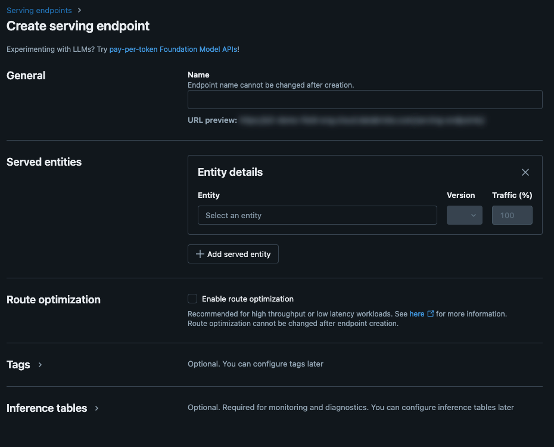
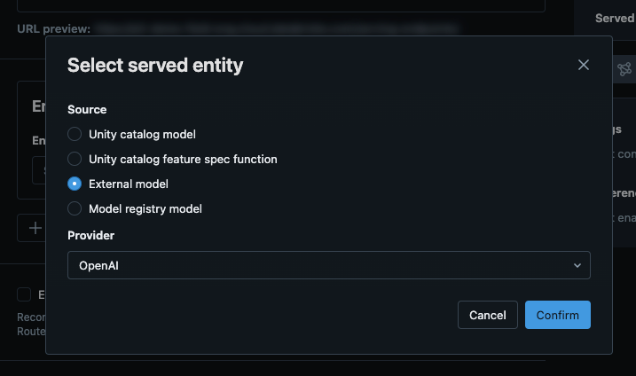
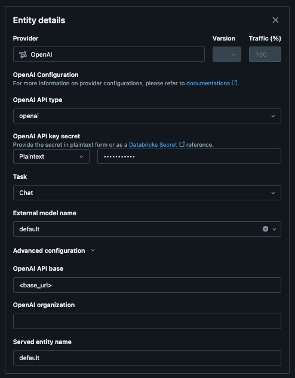

# Deploying a model with EzDeployLite

## Requirements

1. You need access to GPUs (T4, A10, A100, or H100) in your cloud account
2. Your region needs to support gpus (T4, A10, A100, or H100)
3. You need to have access to any compute to run the script from a notebook. (Serverless or interactive)

## What is EzDeployLite?

EzDeployLite will take a prebuilt configuration and deploy it to job clusters and expose via driver proxy api.
This is meant for dev and testing use cases. It will support either vLLM or SGLang as engines.

## Deployment Steps

### 1. Install the library

```python
%pip install mlflow-extensions
dbutils.library.restartPython()
```

### 2. Identify the model to deploy

In this scenario

```python
from mlflow_extensions.databricks.deploy.ez_deploy import EzDeployLite
from mlflow_extensions.databricks.prebuilt import prebuilt

deployer = EzDeployLite(
  ez_deploy_config=prebuilt.vision.vllm.QWEN2_VL_7B_INSTRUCT
)

deployment_name = "my_qwen_model"
# this will return a job run url where the model is deployed and running
deployer.deploy(deployment_name)
```

**NOTE: THE MODEL WILL RUN INDEFINITELY AND NOT SCALE TO ZERO**

### 3. Monitor the deployment

You will receive an url for the job run url. Monitor that url to see the status of the deployment.

## Querying using OpenAI SDK

The models are deployed as a pyfunc and they do not support natural json and need to fit the pyfunc spec. To allow you
to
use OpenAI, langchain, etc. we offer a compatability interface for those clients.

Make sure you install the latest version of openai sdk.

```python
%pip install -U openai
dbutils.library.restartPython()
```

```python
from openai import OpenAI
from mlflow.utils.databricks_utils import get_databricks_host_creds
from mlflow_extensions.serving.compat import get_ezdeploy_lite_openai_url

deployment_name = "my_qwen_model"
base_url = get_ezdeploy_lite_openai_url(deployment_name)

client = OpenAI(base_url=base_url, api_key=get_databricks_host_creds().token)
for i in client.models.list():
    model = i.id

response = client.chat.completions.create(
    # models will have their own name and will also have an alias called "default"
    model="default",
    messages=[
        {
            "role": "user",
            "content": "Hi how are you?"
        }
    ],
)
```

## Querying using Langchain SDK

You can also use query the data using ChatOpenAI using langchain sdk.

```python
from mlflow_extensions.serving.compat.langchain import ChatOpenAI
# if you want to use completions
# from mlflow_extensions.serving.compat.langchain import OpenAI

# this ChatOpenAI is imported from mlflow_extensions.serving.compat.langchain
from mlflow_extensions.serving.compat import get_ezdeploy_lite_openai_url

deployment_name = "my_qwen_model"
base_url = get_ezdeploy_lite_openai_url(deployment_name)

model = ChatOpenAI(
    model="default", # default is the alias for the model
    base_url=base_url, 
    api_key="<dapi...>"
)
model.invoke("what color is the sky?")
```

## Registering into Mosaic AI Gateway


### Requirements

To register into Mosaic AI Gateway you need the following things:

1. Base URL of the deployment
2. Token to the workspace
3. Model deployment name (this will always be `default` for vllm models)

To retrieve the base_url you can run this on the workspace where the model is deployed:

```python
from mlflow_extensions.serving.compat import get_ezdeploy_lite_openai_url

deployment_name = "my_qwen_model"
base_url = get_ezdeploy_lite_openai_url(deployment_name)
```

To retrieve the token its basically the databricks token of the user who deployed the model.

The following steps will show you what it looks like in the Databricks UI

### Setting up a new Mosaic AI Gateway Endpoint



### Setting up the external OpenAI endpoint



### Configure the settings

1. Make sure you set the OpenAI API Base (look at the [requirements](#requirements_1) for the base url)
2. Make sure you set the external model name to default (you can just type in the input)
3. Ensure that you set the OpenAI API key secret to the databricks token


